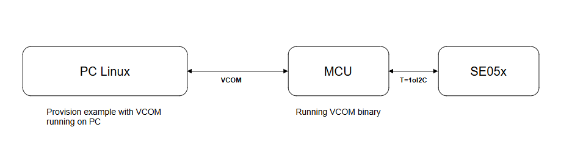
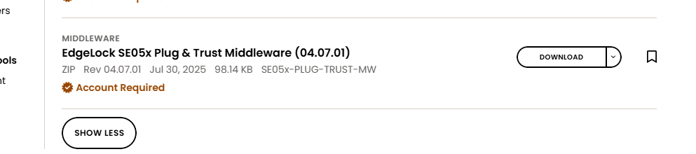
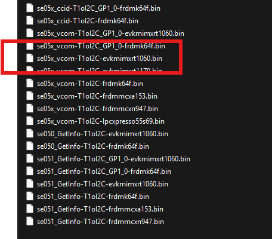

# Provisioning SE05x for NFC commissioning

The Provisioning example - [SE051H Provision Example](https://github.com/NXP/plug-and-trust/blob/int/CHIPSE_Release/demos/se051h_nfc_comm_prov/readme.md) can be used to create all crypto objects required for NFC commissioning.

The example is supported for the following host platforms

- FRDM i.MX93
- RT1060 EVKC
- RW612
- MCX W-72

Refer [SE051H Provision Example](https://github.com/NXP/plug-and-trust/blob/int/CHIPSE_Release/demos/se051h_nfc_comm_prov/readme.md) for build instructions for each platform.

## Provisioning using Linux Machine

In addition to above platforms, the example can also be built with VCOM support for Linux. The below image shows the provisioning setup,



### Step 1

Flash the VCOM binary to MCU. The pre-compiled VCOM binaries can be found from the SE05x middle-ware package.
Download from here - https://www.nxp.com/products/SE051



The binaries are placed in - `simw-top\binaries\MCU\se05x`




### Step 2

Compile the provision example for Linux using vcom in gn option as

```
cd simw-top-mini/repo/demos/se051h_nfc_comm_prov/linux
gn gen out --args="chip_se05x_smcom=\"vcom\""
ninja -C out se051h_nfc_comm_prov
./se051h_nfc_comm_prov --help
```
